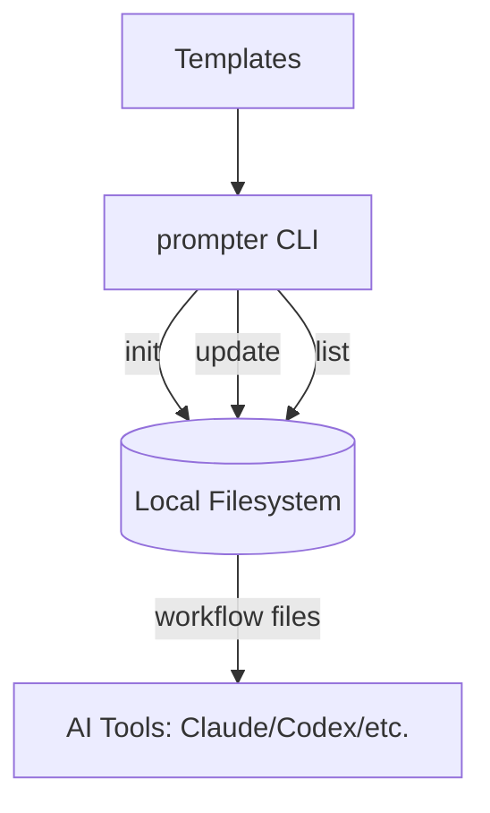

Product Specification Document

### 1. Executive Summary
- Product name and tagline: **Prompter CLI** — “Enhance prompts directly in your AI coding workflow.”
- Core value proposition: Turn rough ideas into **structured, professional prompt specifications** and install tool-specific slash-command workflows in local repos.
- Primary target users: Developers/teams using AI coding assistants who want standardized prompt enhancement workflows.
- Key differentiators: **Multi-tool workflow generation**, **local-first** (filesystem-only), and **managed template updates** using embedded markers.

### 2. Product Overview
- **Problem Statement:** AI prompt quality is inconsistent; teams need a repeatable way to transform rough ideas into high-quality specs and make them available as slash commands in their tools.
- **Solution:** A CLI that initializes a project with Prompter context, generates slash-command workflow files for supported AI tools, and helps list enhanced prompts.
- **Success Metrics:**
  - Successful initialization rate (`prompter init` completes).
  - Number of workflow files created/updated.
  - Number of enhanced prompts listed (`prompter list` output count).
- **Scope:**
  - **Included:** CLI commands (`init`, `update`, `list`), file templates for workflows, project context file, and detection of enhanced prompts.
  - **Excluded:** Actual prompt enhancement execution (done by the AI tool), remote services, authentication, telemetry.

### 3. User Personas
- **Primary: AI-Enabled Developer**
  - Goals: Quickly bootstrap AI prompt workflows; keep workflows up to date.
  - Pain points: Inconsistent prompt specs; manual setup across tools.
- **Secondary: Team Lead/Architect**
  - Goals: Standardize AI prompt practices across team repos.
  - Pain points: Tool fragmentation and drift in prompt instructions.
- **Use Case Scenarios:**
  - New repo bootstrap → run `prompter init` to scaffold workflows.
  - Existing repo update → run `prompter update` to refresh managed sections.
  - Review prompt history → run `prompter list` to see enhanced specs.

### 4. Feature Specifications

**Feature Name:** CLI Initialization
- **Description:** Creates `prompter/` directory, `prompter/project.md`, optional `AGENTS.md`, and tool-specific workflow files.
- **User Flow:**
  1. User runs `prompter init`.
  2. CLI checks if `prompter/` exists; if so, exits with warning.
  3. User selects tools (interactive checkbox) or passes `--tools`.
  4. CLI writes templates and workflow files.
  5. CLI prints next steps.
- **Acceptance Criteria:**
  - `prompter/` directory created with `project.md`.
  - `AGENTS.md` created only if missing.
  - Tool workflow files created under tool-specific paths.
  - Success message printed.
- **Priority:** Critical
- **Dependencies:** `src/commands/init.ts`, `src/core/config.ts`, templates in `src/core/templates/*`, configurators in `src/core/configurators/slash/*`.

**Feature Name:** Workflow Update
- **Description:** Updates managed template sections in existing workflow files for all supported tools.
- **User Flow:**
  1. User runs `prompter update`.
  2. CLI checks for `prompter/`; if missing, exits with error.
  3. For each tool configurator, updates files containing managed markers.
  4. Outputs updated count.
- **Acceptance Criteria:**
  - If `prompter/` absent, prints error and sets exit code.
  - If managed markers missing, logs failure for that file.
  - Updates only managed section between markers.
- **Priority:** High
- **Dependencies:** `src/commands/update.ts`, `src/core/configurators/slash/base.ts`, `src/core/config.ts`.

**Feature Name:** Enhanced Prompt Listing
- **Description:** Lists existing enhanced prompts under `prompter/<slug>/enhanced-prompt.md`.
- **User Flow:**
  1. User runs `prompter list` (or `--json`).
  2. CLI scans `prompter/` for directories containing `enhanced-prompt.md`.
  3. Outputs list and optional JSON structure.
- **Acceptance Criteria:**
  - JSON output when `--json` used.
  - Empty state messaging when no prompts found.
  - Sorted list by slug.
- **Priority:** Medium
- **Dependencies:** `src/commands/list.ts`, `src/core/config.ts`.

**Feature Name:** Tool-Specific Workflow Generation
- **Description:** Creates or updates slash-command files for supported AI tools.
- **User Flow:**
  1. CLI picks tool configurator based on user selection.
  2. Writes file with frontmatter (if applicable) and managed markers.
- **Acceptance Criteria:**
  - Files created under correct tool paths.
  - Body contains managed markers from `PROMPTER_MARKERS`.
- **Priority:** High
- **Dependencies:** `src/core/configurators/slash/*`, `src/core/templates/slash-command-templates.ts`.

### 5. Technical Architecture
- **System Overview:** Local CLI that reads/writes repository files and generates prompt templates. No server-side components.
- **Technology Stack:**
  - **Language:** TypeScript → compiled to Node.js ES Modules (`src/` → `dist/`).
  - **Runtime:** Node.js >= 20 (`package.json`).
  - **Libraries:** `commander`, `@inquirer/prompts`, `chalk`.
- **Data Models:**
  - `EnhancedPrompt` (in-memory): `{ id, path, createdAt }` in `src/commands/list.ts`.
  - `ToolChoice` and `SUPPORTED_TOOLS` in `src/core/config.ts`.
- **APIs & Integrations:** No network APIs. Integrates with tool-specific file conventions.
- **Infrastructure:** Local filesystem only. CLI entry is `bin/prompter.js` which loads `dist/cli/index.js`.

**Architecture Diagram (Mermaid):**

### 6. Non-Functional Requirements
- **Performance:** Fast file IO; scans only `prompter/` directory.
- **Security:** No authentication; operates on local filesystem; no data transmission.
- **Scalability:** Handles many prompt folders; linear scan in `prompter/`.
- **Reliability:** Uses guarded checks for existing directories; safe updates via marker boundaries.
- **Compliance:** None specified. ⚠️ ASSUMPTION: Local-only operation minimizes compliance needs.

### 7. User Interface Specifications
- **Navigation Structure:** CLI commands:
  - `prompter init`
  - `prompter update`
  - `prompter list`
- **Key Screens/Pages:** Terminal output with colored status messages (`chalk`).
- **Design Patterns:**
  - Interactive selection via checkbox prompt.
  - Managed template sections via markers: `<!-- prompter-managed-start -->` and `<!-- prompter-managed-end -->`.
- **Responsive Behavior:** N/A (CLI).

### 8. Integration Requirements
- **Third-Party Services:** None.
- **APIs Consumed:** None.
- **APIs Provided:** CLI commands only.
- **Webhooks/Events:** None.

### 9. Data Specifications
- **Data Models:**
  - `prompter/project.md` — project context template.
  - Workflow files per tool, e.g., `.codex/prompts/prompter-enhance.md`.
- **Data Flow:** User input → CLI templates → filesystem output → AI tool reads workflow file.
- **Storage Requirements:** Low; markdown text files only.
- **Data Privacy:** No PII processing; files are local. ⚠️ ASSUMPTION: Enhanced prompts may include sensitive text, handled by repo policies.

### 10. Current Limitations & Technical Debt
- No validation of `--tools` inputs; invalid tool IDs are ignored silently (no error path in `src/commands/init.ts`).
- `prompter update` updates all known tools, even if not used in the project.
- No tests present (no `test/` files found).
- Update requires markers; files without them error (`src/core/configurators/slash/base.ts`).

### 11. Assumptions & Inferences
- ⚠️ ASSUMPTION: Prompter is intended to be used as a **global CLI** (`npm install -g`), inferred from README and `package.json` `bin` mapping.
- ⚠️ ASSUMPTION: Enhanced prompts are generated by the AI assistant following the workflow, not by this CLI.
- ⚠️ ASSUMPTION: Users will maintain versioned workflow files in their repos and accept managed updates.
